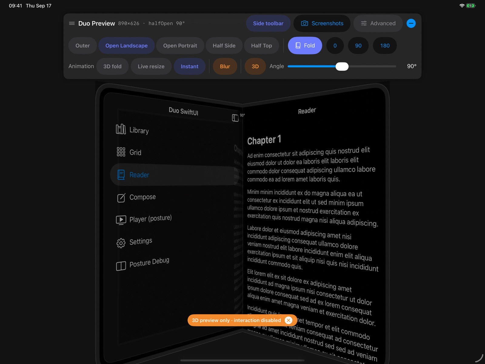

# DuoPreviewKit

Preview your app on the foldable iPhone before Xcode ships a simulator for it.

DuoPreviewKit runs your app inside an emulated foldable device in the **iPad Pro 13"** simulator. You get the outer and
inner screen sizes, animated fold and unfold, a half-open posture with a real hinge position, and matching size classes.
Everything is controlled from an in-app panel, the keyboard, or the terminal.



> Screen sizes, thresholds and size classes are **estimates** until Apple publishes the real specs. They all live in a
> single JSON file, so you can adjust them without touching code.

## Features

- **Screen presets**: outer screen, inner screen in landscape and portrait, and half-screen split layouts
- **Fold animations**: a 3D fold with optional blur, a live resize for catching layout bugs, or an instant switch
- **Half-open posture**: hinge angle and hinge rect, with an optional 3D view of the device
- **UIKit traits and SwiftUI environment values** for posture and hinge, ready to swap for Apple's API later
- **Side toolbar**: moves navigation bar buttons to the right edge on the outer and open landscape screens
- **Debug panel** with simple and advanced modes, plus keyboard shortcuts
- **Tools**: screenshots of every state, a stress test with image diffs, and a JSON state report
- **Terminal control** through Darwin notifications (`notifyutil`)
- **Zero cost in Release**: every API becomes a no-op and no windows are created

## Requirements

- iOS 17+, Swift 6
- **Your app target must support iPad.** Run it on an **iPad simulator**, ideally iPad Pro 13".
- **Run the app full screen.** Smaller windows (Stage Manager, Split View) still work, but the device is scaled down.

### Your app must run as an iPad app

The emulator needs an iPad-sized window. An iPhone-only app launched on an iPad runs in iPhone compatibility mode, in a
390×844 window, and the emulator stays off. The console then says:

```
[DuoPreview] ⚠️ not enabled: window 390×844 is too small for Duo screens …
```

To fix it, add iPad to your target's supported destinations. If you ship an iPhone-only app, do it for the Debug
configuration only:

- In Xcode: **Target → General → Supported Destinations → add iPad**, or
- In Build Settings: set **Targeted Device Family** (`TARGETED_DEVICE_FAMILY`) to `1,2` for **Debug** and keep `1` for
  Release.

Then pick an iPad simulator as the run destination. If Stage Manager is on, make the app window full screen (or turn
Stage Manager off in **Settings → Multitasking & Gestures**) so the device is shown at full size.

## Installation

In Xcode, choose **File → Add Package Dependencies…**, enter
`https://github.com/acc-ai-tech/iphone-duo-simulator`, and add the `DuoPreviewKit` library to your app target.

Or in `Package.swift`:

```swift
dependencies: [
    .package(url: "https://github.com/acc-ai-tech/iphone-duo-simulator.git", from: "0.1.0"),
],
targets: [
    .target(
        name: "App",
        dependencies: [.product(name: "DuoPreviewKit", package: "iphone-duo-simulator")]
    ),
]
```

## Usage

**UIKit.** Install the host in your scene delegate, before `makeKeyAndVisible()`:

```swift
import DuoPreviewKit

window.rootViewController = rootViewController
DuoPreview.install(in: window)
window.makeKeyAndVisible()
```

**SwiftUI.** Add one modifier to your root view:

```swift
import DuoPreviewKit

WindowGroup {
    ContentView()
        .duoPreviewHost()
}
```

That's it. In Debug builds the emulator turns on automatically. Pass `-DuoPreviewOff` or set `DUO_PREVIEW=0` to turn it
off. In Release builds it is always off.

### Reacting to posture

UIKit:

```swift
registerForTraitChanges([DuoPostureTrait.self, DuoHingeTrait.self]) { (self: Self, _) in
    self.view.setNeedsLayout()
}

let posture = traitCollection.duoPosture   // .closed, .halfOpen, .open
let hinge = traitCollection.duoHinge.rect  // .null when the hinge doesn't cross your content
```

SwiftUI:

```swift
@Environment(\.duoPosture) private var posture
@Environment(\.duoHinge) private var hinge
```

`hinge.rect` is in the coordinate space of your root view. In SwiftUI, name that space with
`.coordinateSpace(.named("root"))` on the root view and convert with `proxy.frame(in: .named("root"))`.

The same values are also available as `DuoPreview.posture`, `DuoPreview.hingeAngle`, `DuoPreview.hingeRect`,
`DuoPreview.onStateChange`, `DuoPreview.statePublisher` and `DuoPreview.stateStream`.

### Custom presets

```swift
try DuoPreview.configure(presetsURL: url)
```

See `Sources/DuoPreviewKit/Config/DuoPresets.json` for the format.

## Controls

### Debug panel

The panel sits above the device. Drag it by the header or collapse it into a button.

- **Simple mode**: presets, fold/unfold, 0°/90°/180°, animation style, blur, 3D view, hinge angle slider and screenshots
- **Advanced mode** adds the stress test, a custom screen size, frame/hinge/size overlays and live resize steps

Press ⌘⇧D or double-tap with three fingers to show or hide the panel.

### Keyboard

Turn on **I/O → Keyboard → Send Keyboard Input to Device** in the Simulator first.

| Shortcut | Action |
|---|---|
| ⌘1 … ⌘5 | Switch preset (order from JSON) |
| ⌘F | Fold / unfold |
| ⌘← / ⌘→ | Hinge angle −15° / +15° |
| ⌘⇧A | Cycle animation style |
| ⌘⇧S | Screenshot every state to `Documents/DuoPreview/<timestamp>/` |
| ⌘⇧D | Show / hide the panel |

### Terminal

```sh
duo() { xcrun simctl spawn booted notifyutil -p "com.duolab.$1"; }

duo fold
duo unfold
duo state.inner.portrait     # outer, inner.landscape, inner.portrait, inner.split.half, inner.split.stacked
duo angle.90                 # 0–180 in steps of 5
duo anim.continuous          # realistic, continuous, none
duo option.3d.on             # frame, hinge, 3d, blur, sidetoolbar, sizes, hud, advanced + .on / .off
duo report                   # writes Library/Caches/duolab-report.json in the app container
```

## Side toolbar

On the outer screen and the open landscape inner screen, the navigation bar and toolbar of your app are hidden and their
buttons move into a glass capsule on the right edge. Your content gets a matching right safe area inset. When the device
is half-open, your app's own bars come back.

Turn it off from the panel or with `duo option.sidetoolbar.off`. Configure it per preset with `"sideToolbar"` and set the
width with `"sideToolbarWidth"` in the JSON.

It uses public API only, which has a few limits: a system bar item without an action (for example
`UIBarButtonItem(systemItem: .add)` with no target) can't be told apart from a spacer and is skipped, and apps that toggle
their navigation bar themselves will fight with it.

## Example apps

`Examples/` contains two apps with plenty of content to test against: split views, feeds, galleries, chat, forms, video,
modals and posture-aware layouts.

```sh
cd Examples/DuoExampleUIKit && xcodegen generate && open DuoExampleUIKit.xcodeproj
cd Examples/DuoExampleSwiftUI && xcodegen generate && open DuoExampleSwiftUI.xcodeproj
```

Launch arguments:

| Argument | Effect |
|---|---|
| `-screen <name>` | Open a screen on launch. UIKit: `feed`, `gallery`, `article`, `chat`, `form`, `video`, `modals`, `deepNavigation`, `posture`. SwiftUI: `library`, `grid`, `reader`, `compose`, `player`, `settings`, `posture` |
| `-duoPresets /path/to/presets.json` | Load custom presets |

## Known limitations

- Form sheets, page sheets, alerts, popovers and the keyboard are positioned relative to the iPad window, not the
  emulated screen. `.currentContext` and `.overCurrentContext` presentations stay inside.
- The status bar and home indicator belong to the iPad. Emulated safe areas come from the JSON (zero for now).
- The 3D half-open view shows periodic snapshots, so interaction is disabled while it's on. Rendering live content on two
  rotated halves isn't possible with public API.
- The first frame of a SwiftUI app renders at iPad size before the host is installed.

See [NOTES.md](NOTES.md) for design decisions, research findings and measurements.

## Running the tests

```sh
xcodebuild test -scheme DuoPreviewKit -destination 'platform=iOS Simulator,name=iPad Pro 13-inch (M5)'
```

## License

MIT. See [LICENSE](LICENSE).
